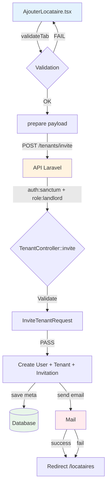

# 📋 AUDIT COMPLET - WORKFLOW AJOUT LOCATAIRE

## 1️⃣ ANALYSE DU WORKFLOW FRONT-END (REACT)

### Composant responsable
- **Fichier**: [`Frontend/src/pages/Proprietaire/components/AjouterLocataire.tsx`](Frontend/src/pages/Proprietaire/components/AjouterLocataire.tsx)

### Liste des champs du formulaire

| Champ Formulaire | Type | Required | Default | Validation |
|-----------------|------|----------|---------|------------|
| tenantType | string | Non | "particulier" | - |
| firstName | string | **Oui** | "" | max:100 |
| lastName | string | **Oui** | "" | max:100 |
| email | string | **Oui** | "" | email |
| phone | string | **Oui** | "" | max:20 |
| birthDate | string | Non | "" | date |
| birthPlace | string | Non | "" | max:100 |
| address | string | Non | "" | max:255 |
| city | string | Non | "Cotonou" | max:100 |
| country | string | Non | "Bénin" | max:100 |
| maritalStatus | string | Non | "single" | - |
| emergencyContactName | string | Non | "" | max:200 |
| emergencyContactPhone | string | Non | "" | max:20 |
| emergencyContactEmail | string | Non | "" | email |
| notes | string | Non | "" | - |
| profession | **Oui** | Non | "" | max:150 |
| employer | string | Non | "" | max:200 |
| contractType | string | Non | "" | max:50 |
| monthlyIncome | string | Non | "" | numeric, min:0 |
| annualIncome | string | Non | "" | numeric, min:0 |
| hasGuarantor | boolean | Non | false | - |
| guarantorName | string | Non* | "" | max:200 |
| guarantorPhone | string | Non* | "" | max:20 |
| guarantorEmail | string | Non* | "" | email |
| guarantorProfession | string | Non* | "" | max:150 |
| guarantorMonthlyIncome | string | Non* | "" | numeric |
| guarantorAnnualIncome | string | Non* | "" | numeric |
| guarantorAddress | string | Non* | "" | max:255 |
| guarantorBirthInfo | string | Non* | "" | max:200 |
| documentType | string | Non | "" | - |
| uploadedFiles | | [] File[] | Non | max:15MB |

*Required only if hasGuarantor = true

### Fichier service/API

**Fichier**: [`Frontend/src/services/api.ts`](Frontend/src/services/api.ts:602)

| Élément | Détail |
|---------|--------|
| URL | `/tenants/invite` |
| Méthode | POST |
| Fonction | `tenantService.inviteTenant(payload)` |
| Auth | Bearer token (sanctum) |

### Payload envoyé à l'API

```typescript
{
  first_name: string,
  last_name: string,
  email: string,
  phone?: string,
  birth_date?: string,
  birth_place?: string,
  address?: string,
  city?: string,
  country?: string,
  marital_status?: string,
  tenant_type?: string,
  emergency_contact_name?: string,
  emergency_contact_phone?: string,
  emergency_contact_email?: string,
  profession?: string,
  employer?: string,
  contract_type?: string,
  monthly_income?: number,
  annual_income?: number,
  has_guarantor?: boolean,
  guarantor_name?: string,
  guarantor_phone?: string,
  guarantor_email?: string,
  guarantor_profession?: string,
  guarantor_monthly_income?: number,
  guarantor_annual_income?: number,
  guarantor_address?: string,
  guarantor_birth_info?: string,
  notes?: string,
}
```

### Gestion des erreurs
- ✅ Gestion des erreurs API via try/catch
- ✅ Messages d'erreur affichés via toasts
- ✅ Redirection vers /proprietaire/locataires en succès

---

## 2️⃣ ANALYSE DE L'ENDPOINT BACKEND

### Route APIFichier**: [`Backend

**/routes/api.php`](Backend/routes/api.php:312)

| Endpoint | Méthode | Contrôleur | Middleware | Protection |
|----------|---------|------------|------------|------------|
| `/api/tenants/invite` | POST | TenantController::invite | auth:sanctum + role:landlord | ✅ Authentifié |
| `/api/tenants` | GET | TenantController::index | auth:sanctum + role:landlord | ✅ Authentifié |

### Middleware appliqués
1. `auth:sanctum` - Vérifie l'authentification
2. `role:landlord` - Vérifie que l'utilisateur est un propriétaire

---

## 3️⃣ ANALYSE DU CONTRÔLEUR LARAVEL

### Méthode de création

**Fichier**: [`Backend/app/Http/Controllers/Api/TenantController.php:380`](Backend/app/Http/Controllers/Api/TenantController.php:380) - `invite()`

### Validation request

**Fichier**: [`Backend/app/Http/Requests/InviteTenantRequest.php`](Backend/app/Http/Requests/InviteTenantRequest.php)

| Champ reçu | Validé ? | Sauvegardé ? | Ignoré ? |
|------------|-----------|---------------|-----------|
| email | ✅ Required | ✅ user + tenant | - |
| first_name | ✅ Required | ✅ tenant | - |
| last_name | ✅ Required | ✅ tenant | - |
| phone | ✅ Nullable | ✅ user + meta | - |
| birth_date | ✅ Nullable | ✅ meta | - |
| birth_place | ✅ Nullable | ✅ meta | - |
| address | ✅ Nullable | ✅ meta | - |
| city | ✅ Nullable | ✅ meta | - |
| country | ✅ Nullable | ✅ meta | - |
| marital_status | ✅ Nullable | ✅ meta | - |
| tenant_type | ✅ Nullable | ✅ meta | - |
| emergency_contact_name | ✅ Nullable | ✅ meta | - |
| emergency_contact_phone | ✅ Nullable | ✅ meta | - |
| emergency_contact_email | ✅ Nullable | ✅ meta | - |
| profession | ✅ Nullable | ✅ meta | - |
| employer | ✅ Nullable | ✅ meta | - |
| contract_type | ✅ Nullable | ✅ meta | - |
| monthly_income | ✅ Nullable | ✅ meta | - |
| annual_income | ✅ Nullable | ✅ meta | - |
| has_guarantor | ✅ Nullable | ✅ meta | - |
| guarantor_name | ✅ Nullable | ✅ meta | - |
| guarantor_phone | ✅ Nullable | ✅ meta | - |
| guarantor_email | ✅ Nullable | ✅ meta | - |
| guarantor_profession | ✅ Nullable | ✅ meta | - |
| guarantor_monthly_income | ✅ Nullable | ✅ meta | - |
| guarantor_annual_income | ✅ Nullable | ✅ meta | - |
| guarantor_address | ✅ Nullable | ✅ meta | - |
| guarantor_birth_info | ✅ Nullable | ✅ meta | - |
| notes | ✅ Nullable | ✅ meta | - |
| documents | ✅ Nullable | ❌ **NON implémenté** | - |
| document_types | ✅ Nullable | ❌ **NON implémenté** | - |

### Incohérences identifiées

1. **Documents non traités**: Le frontend collecte les fichiers mais ne les envoie PAS à l'API
2. **guarantor_birth_info**: Le frontend envoie une chaîne, mais le modèle a `guarantor_birth_date` (date) et `guarantor_birth_place` (string)

---

## 4️⃣ ANALYSE DU MODÈLE TENANT

**Fichier**: [`Backend/app/Models/Tenant.php`](Backend/app/Models/Tenant.php)

### $fillable

| Champ | Type | Nullable |
|-------|------|----------|
| user_id | bigint | Non |
| first_name | string | Non |
| last_name | string | Non |
| email | string | Oui |
| phone | string | Oui |
| birth_date | date | Oui |
| birth_place | string | Oui |
| marital_status | string | Oui |
| profession | string | Oui |
| employer | string | Oui |
| annual_income | decimal | Oui |
| monthly_income | decimal | Oui |
| contract_type | string | Oui |
| address | string | Oui |
| zip_code | string | Oui |
| city | string | Oui |
| country | string | Oui |
| emergency_contact_name | string | Oui |
| emergency_contact_phone | string | Oui |
| emergency_contact_email | string | Oui |
| notes | text | Oui |
| status | enum | Non |
| tenant_type | string | Oui |
| guarantor_name | string | Oui |
| guarantor_phone | string | Oui |
| guarantor_email | string | Oui |
| guarantor_profession | string | Oui |
| guarantor_income | decimal | Oui |
| guarantor_monthly_income | decimal | Oui |
| guarantor_address | string | Oui |
| guarantor_birth_date | date | Oui |
| guarantor_birth_place | string | Oui |
| document_type | string | Oui |
| document_path | string | Oui |
| meta | json | Oui |
| solvency_score | decimal | Oui |

### Relations

| Relation | Type | Utilisation |
|----------|------|-------------|
| user | BelongsTo | Utilisateur associé |
| leases | HasMany | Baux du locataire |
| properties | BelongsToMany | Biens attribués |
| propertyAssignments | HasMany | Assignations property_user |
| payments | HasMany | Paiements |
| rentReceipts | HasMany | Quittances |
| maintenanceRequests | HasMany | Demandes d'intervention |
| notices | HasMany | Préavis |

---

## 5️⃣ ANALYSE BASE DE DONNÉES

### Structure table tenants

| Champ DB | Nullable | Présent Form | Présent Validation | Présent Affichage |
|----------|----------|--------------|-------------------|-------------------|
| id | Non | - | - | ✅ |
| user_id | Non | - | - | ✅ |
| first_name | Non | ✅ | ✅ | ✅ |
| last_name | Non | ✅ | ✅ | ✅ |
| email | Oui | ✅ | ✅ | ✅ |
| phone | Oui | ✅ | ✅ | ✅ |
| birth_date | Oui | ✅ | ✅ | ✅ (via meta) |
| birth_place | Oui | ✅ | ✅ | ✅ (via meta) |
| marital_status | Oui | ✅ | ✅ | ✅ (via meta) |
| profession | Oui | ✅ | ✅ | ✅ (via meta) |
| employer | Oui | ✅ | ✅ | ✅ (via meta) |
| annual_income | Oui | ✅ | ✅ | ✅ (via meta) |
| monthly_income | Oui | ✅ | ✅ | ✅ (via meta) |
| contract_type | Oui | ✅ | ✅ | ✅ (via meta) |
| address | Oui | ✅ | ✅ | ✅ (via meta) |
| zip_code | Oui | ❌ | ❌ | ❌ |
| city | Oui | ✅ | ✅ | ✅ (via meta) |
| country | Oui | ✅ | ✅ | ✅ (via meta) |
| emergency_contact_name | Oui | ✅ | ✅ | ✅ (via meta) |
| emergency_contact_phone | Oui | ✅ | ✅ | ✅ (via meta) |
| emergency_contact_email | Oui | ✅ | ✅ | ✅ (via meta) |
| notes | Oui | ✅ | ✅ | ✅ (via meta) |
| status | Non | - | Auto | ✅ |
| tenant_type | Oui | ✅ | ✅ | ✅ (via meta) |
| guarantor_name | Oui | ✅ | ✅ | ✅ (via meta) |
| guarantor_phone | Oui | ✅ | ✅ | ✅ (via meta) |
| guarantor_email | Oui | ✅ | ✅ | ✅ (via meta) |
| guarantor_profession | Oui | ✅ | ✅ | ✅ (via meta) |
| guarantor_income | Oui | ❌ | ❌ | ❌ |
| guarantor_monthly_income | Oui | ✅ | ✅ | ✅ (via meta) |
| guarantor_address | Oui | ✅ | ✅ | ✅ (via meta) |
| guarantor_birth_date | Oui | ❌ | ❌ | ❌ |
| guarantor_birth_place | Oui | ❌ | ❌ | ❌ |
| document_type | Oui | ✅ (UI) | ✅ | ✅ (via meta) |
| document_path | Oui | ❌ | ❌ | ❌ |
| meta | Oui | ✅ | ✅ | ✅ |
| solvency_score | Oui | - | Auto | ✅ |

---

## 6️⃣ ANALYSE DE LA PAGE DE GESTION DES LOCATAIRES

**Fichier**: [`Frontend/src/pages/Proprietaire/components/TenantsList.tsx`](Frontend/src/pages/Proprietaire/components/TenantsList.tsx)

### Données affichées

| Champ en DB | Affiché ? | Exploité ? | Filtrable ? |
|-------------|-----------|-------------|--------------|
| Nom complet | ✅ | ✅ | ✅ (search) |
| Email | ✅ | ✅ | ✅ (search) |
| Téléphone | ✅ | ✅ | Non |
| Bien | ✅ | ✅ | ✅ (filterBien) |
| Status | ✅ | ✅ | Non |
| Solde | ✅ (0) | Non | Non |

### Fonctionnalités

- ✅ Recherche par nom/email
- ✅ Filtrage par bien
- ✅ Pagination (25/50/100)
- ✅ Ajout de locataire (navigate)
- ❌ Pas de modification
- ❌ Pas de suppression
- ❌ Pas de détails

---

## 7️⃣ ANALYSE DES ACTIONS MANQUANTES

### Actions CRUD

| Action | Statut | Route | Contrôleur |
|--------|--------|-------|-------------|
| Création | ✅ Implémenté | POST /tenants/invite | TenantController::invite |
| Lecture (liste) | ✅ Implémenté | GET /tenants | TenantController::index |
| Lecture (détail) | ❌ Manquant | - | - |
| Mise à jour | ❌ Manquant | - | - |
| Suppression | ❌ Manquant | - | - |

### Actions supplémentaires manquantes

| Action | Statut |
|--------|--------|
| Suspension locataire | ❌ Manquant |
| Historique des paiements | ❌ Manquant |
| Lien avec bail | ✅ Partiel (NouvelleLocation) |
| Lien avec bien | ✅ Partiel |
| Audit trail | ❌ Manquant |
| Envoi de documents | ❌ Non implémenté (despite validation exists) |

---

## 8️⃣ RAPPORT FINAL - INCOHÉRENCES ET RECOMMANDATIONS

### 🔴 INCOHÉRENCES CRITIQUES

1. **Documents non uploadés**
   - Le formulaire collecte les fichiers localement
   - La validation backend attend `documents` et `document_types`
   - **MAIS** le frontend n'envoie jamais ces fichiers
   - **Solution**: Modifier `handleSubmit` pour envoyer FormData avec fichiers

2. ** guarantor_birth_info vs guarantor_birth_date / guarantor_birth_place**
   - Frontend: `guarantorBirthInfo` (string unique)
   - Backend model: `guarantor_birth_date` (date) + `guarantor_birth_place` (string)
   - **Solution**: Parser la chaîne ou modifier le frontend

### 🟡 CHAMPS MANQUANTS

| Champ | Problème | Impact |
|-------|----------|--------|
| zip_code | Non envoyé par frontend | Faible |
| guarantor_income | Non envoyé (annual=oui, monthly=oui) | Faible |
| guarantor_birth_date | Non envoyé | Moyen |
| guarantor_birth_place | Non envoyé | Moyen |
| document_path | Non géré | Élevé |

### 🟢 VALIDATIONS MANQUANTES

- Validation de téléphone (format)
- Validation de revenus (cohérence monthly/annual)
- Vérification unicité email

### 🔵 RECOMMANDATIONS PRIORITAIRES

1. **Haute priorité**
   - Implémenter l'upload des documents
   - Ajouter endpoint PUT /tenants/{id}
   - Ajouter endpoint DELETE /tenants/{id}

2. **Moyenne priorité**
   - Synchroniser guarantor_birth_info avec les champs DB
   - Ajouter la validation des revenus
   - Implémenter la suspension

3. **Basse priorité**
   - Ajouter l'audit trail
   - Améliorer l'affichage des détails locataire
   - Ajouter l'historique des paiements

---

## DIAGRAMME DE FLUX ACTUEL



---

*Rapport généré le 27/02/2026 - Application de gestion immobilière GestiLoc*
